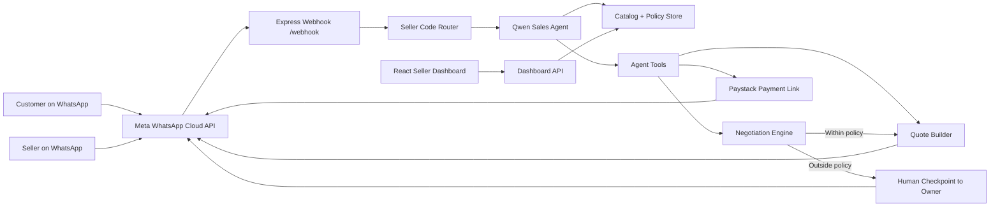

# Chat2Buy Autopilot

Track 4: Autopilot Agent submission for the Qwen Cloud Global AI Hackathon.

Chat2Buy Autopilot is a WhatsApp sales operator for small businesses. It turns one WhatsApp Business number into a multi-seller commerce desk that can onboard sellers, route customers by seller code, answer product and service questions, recommend items, negotiate inside owner-approved rules, escalate risky decisions to a human, create quotes, and hand off payment links.

The project fits Track 4 because it automates a real business workflow end to end: customer inquiry -> seller routing -> sales conversation -> catalog or custom-service discovery -> quote -> negotiation policy check -> human checkpoint when needed -> payment link -> seller order ticket.

## Why This Can Win Track 4

- Real workflow, not a toy demo: WhatsApp is where many small businesses already sell.
- Ambiguous input handling: supports greetings, off-topic chat, tailoring requests, retail browsing, food orders, service bookings, bargaining, and seller switching.
- External tools: Qwen Cloud via DashScope, Meta WhatsApp Cloud API, Paystack checkout, dashboard APIs, weather context, local/business data.
- Human-in-the-loop: discounts outside policy and custom service requests are escalated to the store owner before the assistant commits.
- Production shape: Dockerized backend, static dashboard, health checks, environment-based config, dry-run local simulator, deployment notes for Alibaba Cloud.

## Qwen Model Choice

Default model: `qwen3-235b-a22b-instruct-2507`

Why:

- Alibaba Cloud Model Studio lists Qwen models for text generation and recommends choosing between capability and cost.
- Alibaba Cloud Model Studio bills `qwen3-235b-a22b-instruct-2507` by tokens; your hackathon coupon should cover normal demo usage, but monitor billing.
- It is a better default for natural sales reasoning than the previous `qwen3-coder-plus` default, which was optimized for coding instead of customer conversation.

You can switch models through:

```bash
AI_MODEL=qwen3-235b-a22b-instruct-2507
```

Cost-saving fallback:

```bash
AI_MODEL=qwen-turbo
```

Alibaba recommends moving away from older Turbo toward Flash for many use cases, but `qwen-turbo` is still documented with a free quota. Use `qwen3-235b-a22b-instruct-2507` for the hackathon demo quality while your coupon covers usage.

## Architecture



## Core Features

- Multi-seller routing with unique seller codes.
- Buyers can paste another seller code at any time to switch to another store's AI salesperson.
- Seller onboarding by WhatsApp plus guided dashboard setup.
- Sellers can ask WhatsApp for their seller code, dashboard token, or setup link again.
- Business category adaptation for food, tailoring, fashion retail, shoes and bags, electronics, beauty, services, home goods, events, and general commerce.
- Natural WhatsApp sales style: greetings, persuasive recommendations, price defense, friendly bargaining, and off-topic recovery.
- Catalog grounding: fixed products use real prices only.
- Custom service handling: tailoring and services collect requirements before asking the owner for pricing.
- Negotiation engine: Qwen can propose, but deterministic code approves, counters, or escalates.
- Human checkpoints: custom quotes and risky discounts go to the owner.
- Payment flow through Paystack.
- Local simulator and WhatsApp dry-run mode.
- Alibaba-ready Dockerfile.

## Project Structure

```text
.
|-- app/                         React seller dashboard source
|-- whatsapp-autopilot/           Express webhook, Qwen agent, APIs, local data
|   |-- lib/
|   |   |-- ai.js                 DashScope/Qwen prompts and tool definitions
|   |   |-- negotiation.js        Deterministic discount policy engine
|   |   |-- whatsapp.js           WhatsApp Cloud API client and dry-run mode
|   |   |-- db.js                 JSON local database adapter
|   |-- routes/
|   |   |-- webhook.js            WhatsApp workflow and local simulator
|   |   |-- dashboard-api.js      Seller dashboard API
|   |   |-- paystack-webhook.js   Payment callback handler
|   |-- schema.sql                Production PostgreSQL schema reference
|-- deploy/alibaba/README.md      Alibaba deployment notes
|-- Dockerfile                    Alibaba-ready container build
|-- scripts/copy-dashboard.mjs    Copies Vite build into backend static folder
```

## Local Setup

Install dependencies:

```bash
npm run install:all
```

Create your environment file:

```bash
copy whatsapp-autopilot\.env.example whatsapp-autopilot\.env
```

Set at least:

```bash
DASHSCOPE_API_KEY=your_qwen_model_studio_key
AI_MODEL=qwen3-235b-a22b-instruct-2507
WHATSAPP_DRY_RUN=true
ENABLE_DEV_SIMULATOR=true
PORT=3000
```

Build the dashboard and start the backend:

```bash
npm run build
npm start
```

Open:

```text
http://localhost:3000/health
http://localhost:3000/dashboard
```

## Local Chat Testing Without Meta

With `WHATSAPP_DRY_RUN=true`, replies print in the terminal instead of going to WhatsApp.

Simulate a new seller:

```bash
curl -X POST http://localhost:3000/dev/simulate ^
  -H "Content-Type: application/json" ^
  -d "{\"from\":\"2348000000001\",\"text\":\"SELL\"}"
```

Simulate a customer:

```bash
curl -X POST http://localhost:3000/dev/simulate ^
  -H "Content-Type: application/json" ^
  -d "{\"from\":\"2348000000002\",\"text\":\"hi\"}"
```

When a seller has a live store code, send that code from the customer number, then try:

```text
I want to sew a dress. Can you buy the material or should I bring mine?
```

or:

```text
Show me your menu. I want 2 jollof and can you reduce the price?
```

## Running With Real WhatsApp Locally

Start the server:

```bash
npm start
```

Expose it with ngrok:

```bash
ngrok http 3000
```

Set these in `whatsapp-autopilot/.env`:

```bash
WHATSAPP_DRY_RUN=false
NGROK_URL=https://your-ngrok-domain.ngrok-free.app
DASHBOARD_URL=https://your-ngrok-domain.ngrok-free.app/dashboard
WHATSAPP_ACCESS_TOKEN=your_meta_token
WHATSAPP_PHONE_NUMBER_ID=your_phone_number_id
WHATSAPP_VERIFY_TOKEN=choose_a_secret
```

In Meta dashboard, set callback URL:

```text
https://your-ngrok-domain.ngrok-free.app/webhook
```

Subscribe to the `messages` webhook field.

## Alibaba Cloud Deployment

Build the container:

```bash
docker build -t chat2buy-autopilot .
```

Run locally as a production-like container:

```bash
docker run --env-file whatsapp-autopilot/.env -p 3000:3000 chat2buy-autopilot
```

Deploy the same container to Alibaba Cloud Serverless App Engine, ECS, or Function Compute custom container. Set the environment variables listed in `deploy/alibaba/README.md`.

For Devpost deployment proof, link:

- `whatsapp-autopilot/lib/ai.js` for Alibaba Cloud Model Studio / DashScope API usage.
- `Dockerfile` for the Alibaba-ready container.
- `deploy/alibaba/README.md` for deployment instructions.

## Demo Video Script Under 3 Minutes

1. Show the README track label: Track 4 Autopilot Agent.
2. Open architecture diagram and point to Qwen, WhatsApp, policy engine, human checkpoint, and payment.
3. Run local simulator or real WhatsApp.
4. Seller says `SELL`, completes onboarding, gets dashboard link and seller code.
5. Customer enters seller code and asks a natural request.
6. Show one food/retail order with negotiation and quote.
7. Show one tailoring/custom request that triggers human checkpoint.
8. Show dashboard orders/catalog and Alibaba deployment proof files.

## Submission Checklist

- Public GitHub repository with MIT license.
- Track selected: Track 4: Autopilot Agent.
- Text description explains features and workflow.
- Architecture diagram included in this README.
- Demo video under 3 minutes.
- Proof of Alibaba Cloud deployment via `lib/ai.js`, `Dockerfile`, and `deploy/alibaba/README.md`.
- Testing instructions included above.
- Qwen model and free-tier rationale included above.

## Significant Hackathon Updates

- Reworked Qwen prompt from generic menu bot to category-aware sales operator.
- Added custom service handling for tailoring and other non-catalog businesses.
- Added human checkpoint tool for owner approval.
- Added WhatsApp interactive reply parsing.
- Added local simulator and WhatsApp dry-run mode.
- Added root scripts, Dockerfile, Alibaba deployment docs, and submission README.

## License

MIT. See `LICENSE`.
